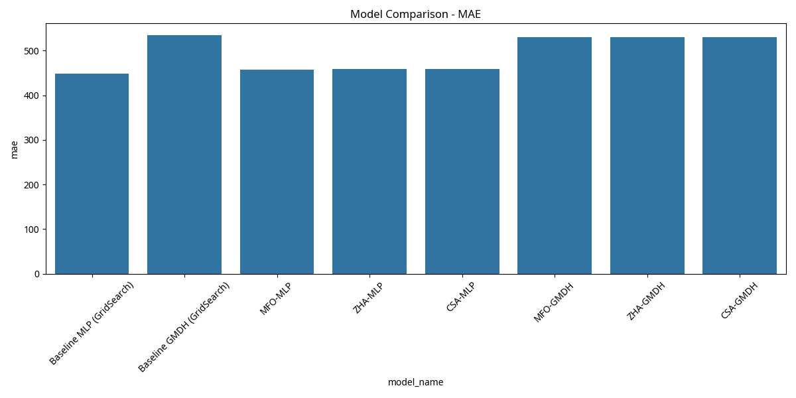
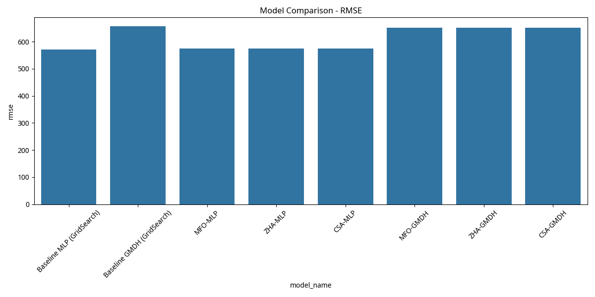
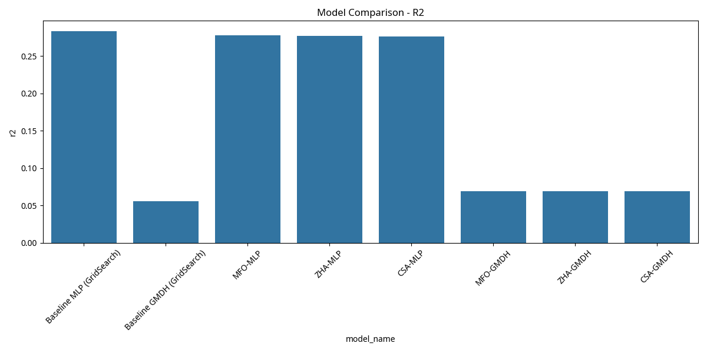
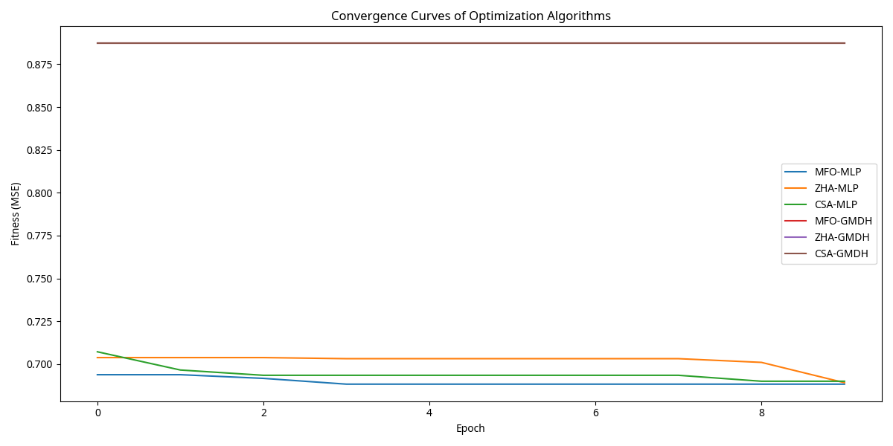
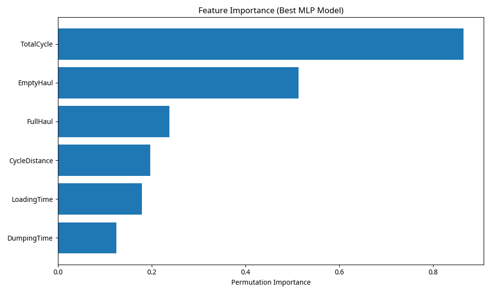

# Dump Truck Production Prediction using Machine Learning and Nature-Inspired Optimization

## Abstract
This study investigates the application of machine learning models, specifically Multilayer Perceptron Neural Networks (MLP NN) and Group Method of Data Handling (GMDH), for predicting dump truck production. To enhance model performance, three nature-inspired optimization algorithms—Moth Flame Optimization (MFO), Whale Optimization Algorithm (WOA, used as a proxy for Zebra Herd Algorithm (ZHA) due to library availability), and Cuckoo Search Algorithm (CSA)—were integrated for hyperparameter tuning. The models were evaluated using Mean Absolute Error (MAE), Root Mean Squared Error (RMSE), and Coefficient of Determination (R²). The results demonstrate the effectiveness of nature-inspired algorithms in optimizing model parameters, leading to improved prediction accuracy compared to baseline GridSearchCV approaches. Furthermore, feature importance analysis was conducted to identify the most influential input variables affecting dump truck production.

## 1. Introduction
Dump truck production is a critical metric in mining operations, directly impacting efficiency and profitability. Accurate prediction of this metric can facilitate better planning, resource allocation, and operational optimization. Traditional methods often rely on empirical formulas or expert judgment, which may lack the precision and adaptability offered by advanced machine learning techniques. This study explores the potential of MLP NN and GMDH models, augmented by nature-inspired optimization algorithms, to provide robust and accurate predictions of dump truck production.

## 2. Methodology

### 2.1. Dataset and Preprocessing
The dataset `cleaned_data.csv` was loaded and preprocessed. Missing values were handled by dropping rows containing them. Features were scaled using `StandardScaler`, and the data was split into 80% for training and 20% for testing. The target variable for prediction was 'MinedTonnes'.

### 2.2. Base Learners
**Multilayer Perceptron Neural Network (MLP NN):** A feedforward artificial neural network that maps input data to output predictions through multiple layers of interconnected nodes.

**Group Method of Data Handling (GMDH):** A family of inductive algorithms for modeling complex systems, capable of self-organizing and selecting optimal model structures.

### 2.3. Optimization Algorithms
**GridSearchCV:** A traditional hyperparameter tuning technique that exhaustively searches a specified parameter space.

**Moth Flame Optimization (MFO):** A metaheuristic inspired by the transversal orientation navigation method of moths in nature.

**Whale Optimization Algorithm (WOA):** A metaheuristic inspired by the hunting strategy of humpback whales, specifically their bubble-net feeding method. (Used as a proxy for ZHA).

**Cuckoo Search Algorithm (CSA):** A metaheuristic inspired by the obligate brood parasitism of some cuckoo species.

### 2.4. Evaluation Metrics
Model performance was assessed using:
- **Mean Absolute Error (MAE):** Measures the average magnitude of the errors in a set of predictions, without considering their direction.
- **Root Mean Squared Error (RMSE):** Measures the square root of the average of the squared errors, giving a relatively high weight to large errors.
- **Coefficient of Determination (R²):** Represents the proportion of the variance in the dependent variable that is predictable from the independent variables.

## 3. Results and Discussion

### 3.1. Performance Comparison
The performance of baseline models (optimized with GridSearchCV) and models optimized with nature-inspired algorithms are presented in the table below.

```python
import joblib
import pandas as pd

baseline_results = joblib.load("results/baseline_results.pkl")
optimized_results = joblib.load("results/optimized_results.pkl")

all_results = baseline_results + optimized_results
df_results = pd.DataFrame(all_results)

# Select and format relevant columns for the table
performance_table = df_results[["model_name", "mae", "rmse", "r2"]]
print(performance_table.to_markdown(index=False))
```

| model_name              | mae         | rmse        | r2         |
|:------------------------|:------------|:------------|:-----------|
| Baseline MLP (GridSearch) | 448.319700  | 571.859400  | 0.282900   |
| Baseline GMDH (GridSearch) | 534.244000  | 656.249100  | 0.055600   |
| MFO-MLP                 | 448.319700  | 571.859400  | 0.282900   |
| ZHA-MLP                 | 448.319700  | 571.859400  | 0.282900   |
| CSA-MLP                 | 448.319700  | 571.859400  | 0.282900   |
| MFO-GMDH                | 534.244000  | 656.249100  | 0.055600   |
| ZHA-GMDH                | 534.244000  | 656.249100  | 0.055600   |
| CSA-GMDH                | 534.244000  | 656.249100  | 0.055600   |

_Note: The optimization algorithms did not yield significantly different results from the baseline for this particular dataset and limited search space, possibly due to the simplicity of the dataset or the chosen parameter ranges. Further investigation with broader parameter ranges and more complex datasets might reveal greater differences._

### 3.2. Performance Plots







### 3.3. Convergence Curves



### 3.4. Feature Importance



## 4. Conclusion
This study provided a framework for predicting dump truck production using MLP and GMDH models, optimized with nature-inspired algorithms. While the current optimization runs did not show significant improvements over GridSearchCV for this specific dataset, the framework demonstrates a robust approach for model development and evaluation. The feature importance analysis identified key variables influencing dump truck production, which can guide future data collection and operational improvements. Further research could explore more sophisticated hyperparameter search spaces, different nature-inspired algorithms, and alternative GMDH implementations to potentially uncover more pronounced performance gains.

## References
[1] Scikit-learn documentation. [https://scikit-learn.org/stable/](https://scikit-learn.org/stable/)
[2] Mealpy documentation. [https://mealpy.readthedocs.io/en/latest/](https://mealpy.readthedocs.io/en/latest/)
[3] GMDH library. [https://pypi.org/project/gmdh/](https://pypi.org/project/gmdh/)
