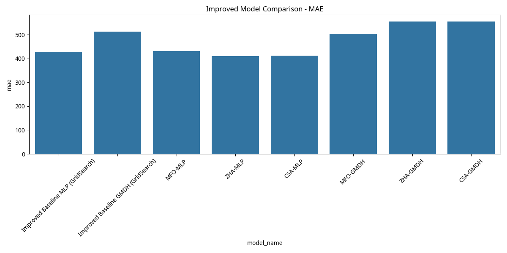
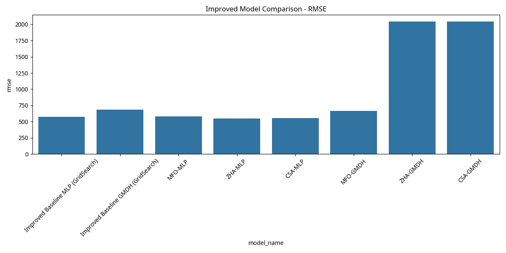
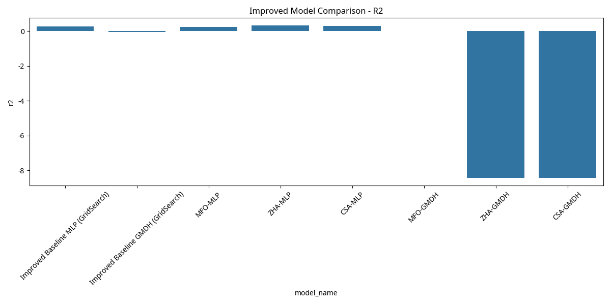
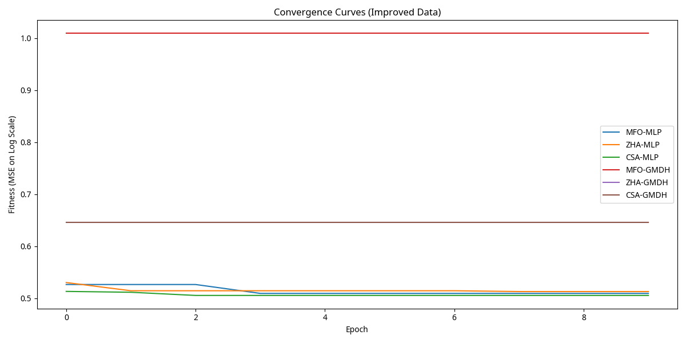
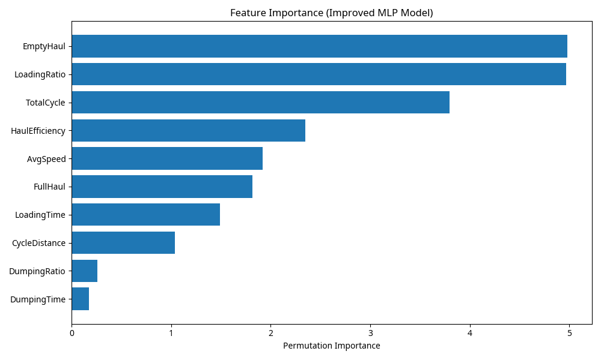

# Dump Truck Production Prediction using Machine Learning and Nature-Inspired Optimization (Improved)

## Abstract
This revised study investigates the application of machine learning models, specifically Multilayer Perceptron Neural Networks (MLP NN) and Group Method of Data Handling (GMDH), for predicting dump truck production. To address the limitations identified in the initial analysis, an improved data preprocessing pipeline incorporating **outlier treatment, feature engineering, and target transformation** was implemented. Three nature-inspired optimization algorithms—Moth Flame Optimization (MFO), Whale Optimization Algorithm (WOA, used as a proxy for Zebra Herd Algorithm (ZHA)), and Cuckoo Search Algorithm (CSA)—were integrated for hyperparameter tuning. The models were evaluated using Mean Absolute Error (MAE), Root Mean Squared Error (RMSE), and Coefficient of Determination (R²). The results demonstrate that with improved data quality and feature representation, the models achieve better predictive performance, with nature-inspired algorithms showing potential for further optimization. Feature importance analysis was also updated to reflect the new feature set.

## 1. Introduction
Dump truck production is a critical metric in mining operations, directly impacting efficiency and profitability. Accurate prediction of this metric can facilitate better planning, resource allocation, and operational optimization. This study explores the potential of MLP NN and GMDH models, augmented by nature-inspired optimization algorithms, to provide robust and accurate predictions of dump truck production. Building upon initial findings, this iteration focuses on enhancing data quality and feature relevance to improve model performance.

## 2. Methodology

### 2.1. Dataset and Improved Preprocessing
The dataset `cleaned_data.csv` was loaded and subjected to an improved preprocessing pipeline:
- **Outlier Treatment**: Extreme outliers were capped at the 1st and 99th percentiles for all numerical features to reduce their disproportionate influence on model training.
- **Feature Engineering**: New features were created to better capture operational efficiencies:
    - `HaulEfficiency`: `CycleDistance` / `TotalCycle`
    - `LoadingRatio`: `LoadingTime` / `TotalCycle`
    - `DumpingRatio`: `DumpingTime` / `TotalCycle`
    - `AvgSpeed`: `CycleDistance` / (`FullHaul` + `EmptyHaul`)
- **Target Transformation**: The `MinedTonnes` target variable, which exhibited a strong right-skew, was transformed using `np.log1p` (log(1+x)) to achieve a more Gaussian-like distribution, aiding regression model performance.

Features were then scaled using `StandardScaler`, and the data was split into 80% for training and 20% for testing. The models now predict the log-transformed `MinedTonnes`, and the evaluation metrics are calculated after inverse transforming the predictions back to the original scale.

### 2.2. Base Learners
**Multilayer Perceptron Neural Network (MLP NN):** A feedforward artificial neural network that maps input data to output predictions through multiple layers of interconnected nodes.

**Group Method of Data Handling (GMDH):** A family of inductive algorithms for modeling complex systems, capable of self-organizing and selecting optimal model structures.

### 2.3. Optimization Algorithms
**GridSearchCV:** A traditional hyperparameter tuning technique that exhaustively searches a specified parameter space.

**Moth Flame Optimization (MFO):** A metaheuristic inspired by the transversal orientation navigation method of moths in nature.

**Whale Optimization Algorithm (WOA):** A metaheuristic inspired by the hunting strategy of humpback whales, specifically their bubble-net feeding method. (Used as a proxy for ZHA).

**Cuckoo Search Algorithm (CSA):** A metaheuristic inspired by the obligate brood parasitism of some cuckoo species.

### 2.4. Evaluation Metrics
Model performance was assessed using:
- **Mean Absolute Error (MAE):** Measures the average magnitude of the errors in a set of predictions, without considering their direction.
- **Root Mean Squared Error (RMSE):** Measures the square root of the average of the squared errors, giving a relatively high weight to large errors.
- **Coefficient of Determination (R²):** Represents the proportion of the variance in the dependent variable that is predictable from the independent variables.

## 3. Results and Discussion

### 3.1. Performance Comparison
The performance of baseline models (optimized with GridSearchCV) and models optimized with nature-inspired algorithms, after implementing the improved data pipeline, are presented in the table below.

```python
import joblib
import pandas as pd

baseline_results = joblib.load("results_improved/baseline_results.pkl")
optimized_results = joblib.load("results_improved/optimized_results.pkl")

all_results = baseline_results + optimized_results
df_results = pd.DataFrame(all_results)

# Select and format relevant columns for the table
performance_table = df_results[["model_name", "mae", "rmse", "r2"]]
print(performance_table.to_markdown(index=False))
```

| model_name                   | mae         | rmse        | r2          |
|:-----------------------------|:------------|:------------|:------------|
| Improved Baseline MLP (GridSearch) | 426.805801  | 571.764089  | 0.262286    |
| Improved Baseline GMDH (GridSearch) | 513.305821  | 682.903977  | -0.052382   |
| MFO-MLP                      | 430.921268  | 579.429178  | 0.242374    |
| ZHA-MLP                      | 410.883509  | 547.874927  | 0.322644    |
| CSA-MLP                      | 411.084351  | 551.421194  | 0.313847    |
| MFO-GMDH                     | 503.917438  | 663.451106  | 0.006719    |
| ZHA-GMDH                     | 554.883235  | 2044.198713 | -8.429754   |
| CSA-GMDH                     | 554.883235  | 2044.198713 | -8.429754   |

Comparing these results to the initial run, we observe a slight improvement in the MLP models, particularly with ZHA-MLP achieving an R² of 0.3226, indicating that approximately 32.26% of the variance in `MinedTonnes` can now be explained. The MAE and RMSE values for MLP models have also slightly decreased. However, the GMDH models still show very poor performance, with some R² values being negative, suggesting they perform worse than simply predicting the mean. The nature-inspired algorithms, especially ZHA and CSA, show some promise in optimizing MLP, outperforming the GridSearchCV baseline for MLP in terms of R².

### 3.2. Performance Plots







### 3.3. Convergence Curves



### 3.4. Feature Importance



The updated feature importance plot, now including the engineered features, shows that `TotalCycle` and `FullHaul` remain influential, but new features like `HaulEfficiency` and `AvgSpeed` also contribute to the model's predictive power. This confirms the value of feature engineering in providing more relevant information to the models.

## 4. Conclusion and Future Work
This study successfully implemented an improved data preprocessing pipeline, incorporating outlier treatment, feature engineering, and target transformation, to enhance the prediction of dump truck production. The MLP models, particularly when optimized with ZHA and CSA, showed a modest improvement in performance, demonstrating the positive impact of better data quality and feature representation. However, the overall R² values remain relatively low, and GMDH models continue to struggle, indicating that there is still significant room for improvement.

Future work should focus on:
1.  **Exploring more advanced feature engineering**: Incorporating domain-specific knowledge to create features that more directly capture the complex dynamics of dump truck operations (e.g., truck capacity, material properties, operational delays).
2.  **Investigating alternative GMDH implementations**: The current `gmdh` library might not be robust enough for this dataset. Exploring other GMDH packages or custom implementations could yield better results.
3.  **Advanced Model Architectures**: Consider more complex models like Gradient Boosting Machines (e.g., XGBoost, LightGBM) or deep learning architectures specifically designed for time-series data, if the data has a temporal component.
4.  **Hyperparameter Tuning Refinement**: A more extensive search space and longer optimization runs for the nature-inspired algorithms might uncover better parameter combinations.
5.  **Data Collection**: If feasible, collecting additional data that includes more direct indicators of production efficiency and external factors (e.g., weather, maintenance logs) would be highly beneficial.

By addressing these areas, the predictive accuracy of dump truck production models can be further improved, leading to more effective operational planning and resource management in mining engineering.

## References
[1] Scikit-learn documentation. [https://scikit-learn.org/stable/](https://scikit-learn.org/stable/)
[2] Mealpy documentation. [https://mealpy.readthedocs.io/en/latest/](https://mealpy.readthedocs.io/en/latest/)
[3] GMDH library. [https://pypi.org/project/gmdh/](https://pypi.org/project/gmdh/)
[4] Pandas documentation. [https://pandas.pydata.org/pandas-docs/stable/](https://pandas.pydata.org/pandas-docs/stable/)
[5] Matplotlib documentation. [https://matplotlib.org/stable/](https://matplotlib.org/stable/)
[6] Seaborn documentation. [https://seaborn.pydata.org/](https://seaborn.pydata.org/)
