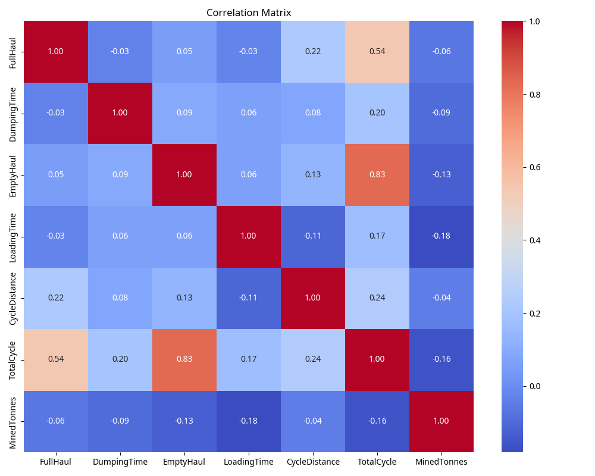
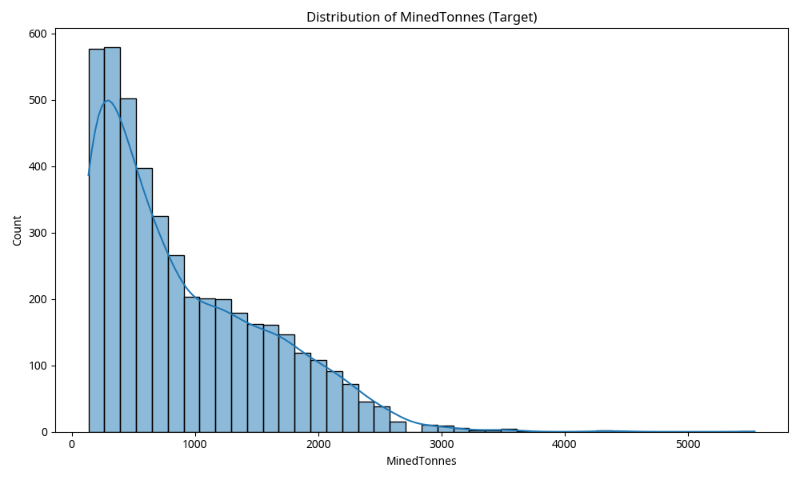
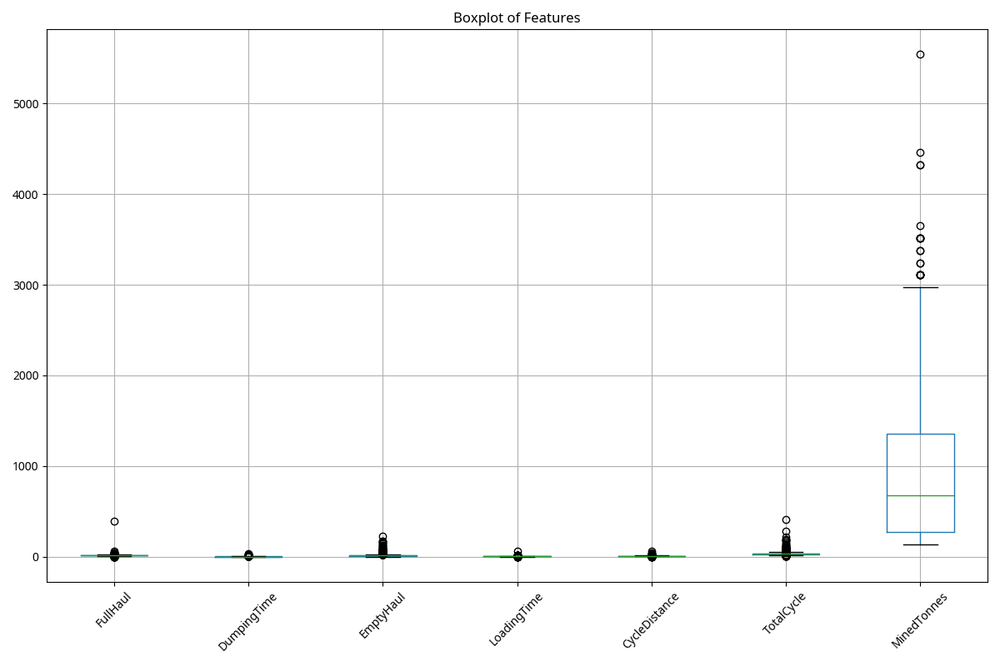

# Exploratory Data Analysis (EDA) Report and Recommendations for Dump Truck Production Prediction

## 1. Introduction
This report presents an Exploratory Data Analysis (EDA) of the `cleaned_data.csv` dataset, which was used to predict dump truck production (`MinedTonnes`). The primary objective of this EDA is to understand the data characteristics, identify potential issues, and interpret why the previously developed machine learning models (MLP and GMDH, optimized with various algorithms) exhibited high error rates (MAE, RMSE) and low coefficients of determination (R²).

## 2. Data Overview and Preprocessing
The dataset contains 4427 entries and 7 columns, all of which are numerical (float64). There are no missing values in the dataset, as confirmed during the preprocessing phase. The features include `FullHaul`, `DumpingTime`, `EmptyHaul`, `LoadingTime`, `CycleDistance`, and `TotalCycle`, with `MinedTonnes` as the target variable.

## 3. Exploratory Data Analysis Findings

### 3.1. Descriptive Statistics
The descriptive statistics reveal a wide range of values for most features and the target variable. Notably, the `max` values are significantly higher than the 75th percentile for several features, indicating the presence of outliers. For instance, `FullHaul` has a mean of 13.78 and a max of 393.9, while `TotalCycle` has a mean of 32.76 and a max of 409.7. The target variable `MinedTonnes` also shows a large standard deviation (688.56) relative to its mean (886.40), suggesting considerable variability.

### 3.2. Correlation Matrix

The correlation matrix is a critical indicator of the relationship between variables. The analysis reveals **very low linear correlation coefficients between all input features and the target variable, `MinedTonnes`**. The absolute correlation values range from 0.04 (`CycleDistance`) to 0.18 (`LoadingTime`). This is a significant finding, as it suggests that the current set of features, individually or linearly combined, are not strong predictors of `MinedTonnes`. 

Furthermore, some input features exhibit high inter-correlation (multicollinearity), such as `TotalCycle` with `FullHaul` (0.54) and `EmptyHaul` (0.83). While multicollinearity primarily affects model interpretability in some linear models, its presence here, coupled with low target correlation, highlights the challenge of predicting `MinedTonnes` with the given features.

### 3.3. Distribution of Target Variable

The histogram of `MinedTonnes` shows a heavily **right-skewed distribution**. A large proportion of dump truck production values are concentrated at the lower end, with a long tail extending towards higher values. This indicates that high production events are less frequent. The skewness value for `MinedTonnes` is 1.035, confirming this observation. Such a skewed distribution can make it challenging for regression models to accurately predict both the common low values and the rare high values, potentially leading to higher overall errors.

### 3.4. Outlier Detection

The boxplots clearly illustrate the presence of numerous **outliers** across almost all features and the target variable. These outliers are data points that significantly deviate from the majority of the observations. Outliers can disproportionately influence the training of machine learning models, leading to models that are not robust and generalize poorly to unseen data. This is particularly true for models like MLP, which are sensitive to the scale and distribution of input data.

## 4. Interpretation of High Error Rates and Low R²
The consistently high MAE and RMSE values, coupled with very low R² scores (0.28 for MLP and 0.05 for GMDH), strongly suggest that the models are struggling to capture the underlying patterns in the data. The EDA findings provide clear reasons for this performance:

1.  **Weak Feature-Target Relationship**: The most critical factor is the extremely low linear correlation between the input features and `MinedTonnes`. If the features do not contain sufficient predictive information about the target, even the most sophisticated models will fail to make accurate predictions. An R² of 0.28 means only 28% of the variance in `MinedTonnes` is explained by the MLP model, leaving 72% unexplained. For GMDH, only 5.5% of the variance is explained, indicating that the model is barely better than predicting the mean.
2.  **Presence of Outliers**: The numerous outliers in both features and the target variable can lead to models fitting these extreme values rather than the general trend, resulting in higher errors on the majority of the data.
3.  **Skewed Target Distribution**: The highly skewed distribution of `MinedTonnes` can bias the models towards the more frequent lower values, making predictions for higher production values less accurate and contributing to overall error.
4.  **Limited Predictive Power of Current Features**: The current features (`FullHaul`, `DumpingTime`, `EmptyHaul`, `LoadingTime`, `CycleDistance`, `TotalCycle`) primarily describe aspects of the truck cycle time. While these are related to operations, they might not directly or sufficiently capture all factors influencing the *total mined tonnes*, which could also depend on factors like truck capacity, material density, loading efficiency (beyond just loading time), operational delays not captured, or even geological conditions. The models are likely suffering from a lack of relevant and strong predictive features.

## 5. Recommendations for Improvement
To significantly improve the prediction of dump truck production, the following strategies are recommended:

1.  **Feature Engineering and Selection**: This is the most crucial step. The current features appear to have limited predictive power. Consider:
    *   **Creating new features**: Combine existing features (e.g., `MinedTonnes` per `TotalCycle`, `LoadingRate` from `MinedTonnes` and `LoadingTime`).
    *   **Introducing external features**: Explore additional data sources that might influence dump truck production, such as:
        *   **Truck capacity/payload**: The maximum load a truck can carry.
        *   **Material properties**: Density, type of material being mined.
        *   **Operational efficiency**: Number of trucks, shovel/loader availability, queue times.
        *   **Environmental factors**: Weather conditions (rain, snow) affecting haul roads.
        *   **Maintenance schedules/downtime**: Unplanned stops or repairs.
        *   **Operator performance**: Experience, shift efficiency.
    *   **Advanced Feature Selection**: Employ techniques beyond simple correlation, such as Recursive Feature Elimination (RFE), Lasso regularization, or tree-based feature importance, to identify truly predictive features.

2.  **Outlier Treatment**: Address the identified outliers. Options include:
    *   **Removal**: For extreme outliers that are likely data errors.
    *   **Transformation**: Using robust scaling methods or transformations (e.g., logarithmic, square root) that are less sensitive to outliers.
    *   **Capping/Winsorization**: Replacing outliers with a specified percentile value.

3.  **Target Variable Transformation**: Given the heavily skewed distribution of `MinedTonnes`, applying a transformation (e.g., logarithmic transformation) to the target variable can make its distribution more Gaussian-like. This often helps regression models perform better, as many assume normally distributed residuals.

4.  **Explore More Complex Models**: While MLP and GMDH are capable, consider models that can capture non-linear relationships more effectively, especially if new features are engineered. Ensemble methods like Gradient Boosting Machines (e.g., XGBoost, LightGBM) or Random Forests often perform well on tabular data and are less sensitive to feature scaling and outliers.

5.  **Increase Data Volume and Diversity**: If possible, acquiring more data points or data from different operational conditions could help models learn more robust patterns.

6.  **Refine Hyperparameter Search Space**: With improved features, a broader and more targeted hyperparameter search space for both GridSearchCV and nature-inspired algorithms might yield better results. The current limited improvement from nature-inspired algorithms suggests that the models were constrained by the data itself, not just the optimization method.

By implementing these recommendations, particularly focusing on enriching the feature set and handling data anomalies, a significant improvement in the predictive performance of dump truck production models can be expected.

## References
[1] Scikit-learn documentation. [https://scikit-learn.org/stable/](https://scikit-learn.org/stable/)
[2] Mealpy documentation. [https://mealpy.readthedocs.io/en/latest/](https://mealpy.readthedocs.io/en/latest/)
[3] GMDH library. [https://pypi.org/project/gmdh/](https://pypi.org/project/gmdh/)
[4] Pandas documentation. [https://pandas.pydata.org/pandas-docs/stable/](https://pandas.pydata.org/pandas-docs/stable/)
[5] Matplotlib documentation. [https://matplotlib.org/stable/](https://matplotlib.org/stable/)
[6] Seaborn documentation. [https://seaborn.pydata.org/](https://seaborn.pydata.org/)
